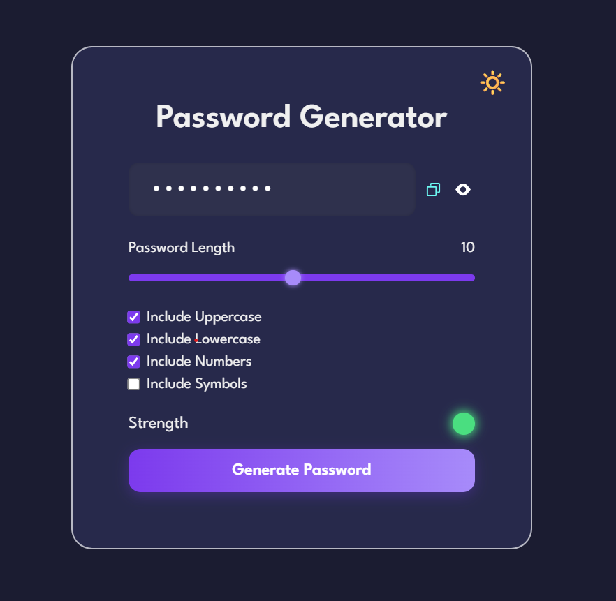
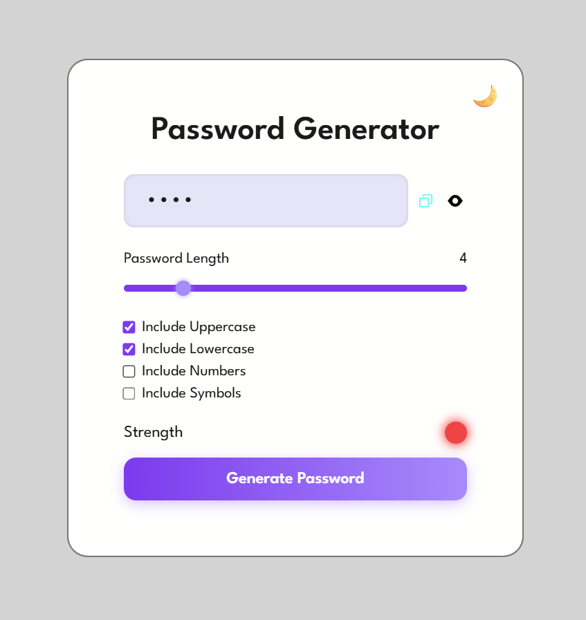

# Random Password Generator
A simple and responsive password generator web app that allows users to create secure, customizable passwords.

## Features
- Toggle between light and dark themes  
- Choose password length (1 to 20 characters)  
- Include uppercase, lowercase, numbers, and symbols  
- Copy password to clipboard  
- Show/hide password visibility  
- Password strength indicator  

## Screenshots

  
  

## Tech Used
- HTML  
- CSS  
- JavaScript  

## Note
This is a frontend-only project with no external libraries or frameworks.
